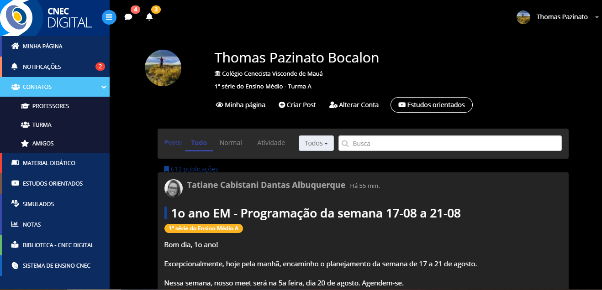

<html lang="en">
<title>Cnec dark mode</title>
<meta charset="UTF-8">
<meta name="viewport" content="width=device-width, initial-scale=1">
<link rel="stylesheet" href="https://www.w3schools.com/w3css/4/w3.css">
<link rel="stylesheet" href="https://fonts.googleapis.com/css?family=Raleway">
<body style="width: 90%"> 

<body class="w3-light-grey w3-content" style="max-width:1600px">

<!-- Sidebar/menu -->
<nav class="w3-sidebar w3-bar-block w3-white w3-animate-left w3-text-grey w3-collapse w3-top w3-center" style="z-index:3;width:300px;font-weight:bold" id="mySidebar"> 
  <h3 class="w3-padding-64 w3-center"><b>CNEC SÓ QUE BOM</b></h3>
  <a href="javascript:void(0)" onclick="w3_close()" class="w3-bar-item w3-button w3-padding w3-hide-large">CLOSE</a>
  <a href="#" onclick="w3_close()" class="w3-bar-item w3-button">COMO USAR</a> 
  <a href="#about" onclick="w3_close()" class="w3-bar-item w3-button">DOWLOAD</a> 
  <a href="#contact" onclick="w3_close()" class="w3-bar-item w3-button">TUTORIAL PROS BURRO</a>
</nav>

<!-- Top menu on small screens -->
<header class="w3-container w3-top w3-hide-large w3-white w3-xlarge w3-padding-16">
  Cnec digital so que preto
  <a href="javascript:void(0)" class="w3-right w3-button w3-white" onclick="w3_open()">☰</a>
</header>

<!-- Overlay effect when opening sidebar on small screens -->

<!-- !PAGE CONTENT! -->

  <!-- Push down content on small screens --> 
  

  

  
  <!-- Modal for full size images on click-->
  

    ×
    

    

  

  <!-- About section -->
  

    <h4><b>COMO USAR</b></h4>
	
Tu mete no chrome, aperta f5 e deu o cnec digital vai tar preto
    

	

    

      <h4>DOWLOAD</h4>
      
Rola um pouco pra baixo e clicar em dowload aqui no site, tu vai fazer dowload de um arquivo .zip.

	  
 depois disso tu extrai a pasta do dowload usando 7zip, winRAR Etc. mas lembra de botar a pasta em um lugar que tu nao vai mudar, pq se tu mudar o lugar dela fode tudo.

	  
	  
Depois disso tu vai no site chrome://extensions/    no google e olha pro canto superior direito e vai estar escrito "Modo de desenvolvedor" dai tu clica pra ativar, depois disso tu só arrasta a pasta já extraida em uma pasta aleatoria do teu PC pro site,
		e depois disso ela devia aparecer ali e ja devia funcionar, dai tem botao de remover, atualizar etc se precisar.
      

	  
      
Se precisar de ajuda chama no zapzap

      
-Thomas

      

      <h4 class="w3-padding-16">DOWLOAD</h4>

      

        

          <ul class="w3-ul w3-white w3-center w3-opacity w3-hover-opacity-off">
            <li class="w3-black w3-xlarge w3-padding-32">CNEC PRETO</li>
            <li class="w3-padding-16">Deixa todos os planos de fundo Escuros</li>
            <li class="w3-padding-16">Funciona em todas as partes</li>
            <li class="w3-padding-16">É daora</li>
            <li class="w3-padding-16">Nao te deixa cego</li>
			<li class="w3-padding-16">Nao te deixa cego</li>
			<li class="w3-padding-16">Nao te deixa cego</li>
			
            
            
            <li class="">
			  <a href="Extensioncnec.zip" download>
              <button class="w3-button w3-white w3-padding-large">DOWLOAD</button>
			  </a>
			  
            </li>
          </ul>
        

        
        

          <ul class="w3-ul w3-white w3-center w3-opacity w3-hover-opacity-off">
            <li class="w3-black w3-xlarge w3-padding-32">CNEC COM UM FUNDO DAORA</li>
            <li class="w3-padding-16">É AQUELA FOTO DO GUS</li>
            <li class="w3-padding-16">É FEIO</li>
            <li class="w3-padding-16">MAS ENGRAÇADO</li>
            <li class="w3-padding-16">SOCORRO</li>
            <li class="w3-padding-16">
              <h2>R$ 100</h2>
              POR MES
            </li>
            <li class="">
			  <a href="gustavo.png" download>
              <button class="w3-button w3-white w3-padding-large">COMPRAR</button>
			  </a>
            </li>
          </ul>
        

      

    

  

  <!-- Contact section -->
  

    

      <h4 class="w3-center"><b>TUTORIAL PROS BURRO</b></h4>
      
Nao.

  <!-- Footer -->
  <footer class="w3-container w3-padding-32 w3-grey">  
    

      

        <h3>INFO</h3>
        
SE CAGAR TEU PC A CULPA NAO É MINHA
   
		
-THOMAS

      

<!-- End page content -->

